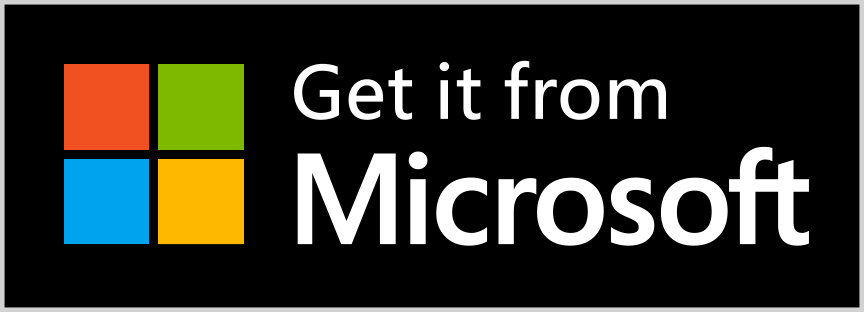

<h1 align="center">
     
    
     
    Notefox
     
</h1>
Official repo of https://notefox.eu.

If you want to use the add-on, please download it on your favourite add-ons store.

To support me, you can buy me a coffee making a donation ❤️ with **LiberaPay** or **PayPal**:

 [</img>](https://paypal.me/saveriomorelli)

## Description

Here you can find the source code of the website (notefox.eu) and APIs.
To read the documentation in a better way, see here: <a href="https://notefox.eu/docs/">Notefox Documentation</a>.